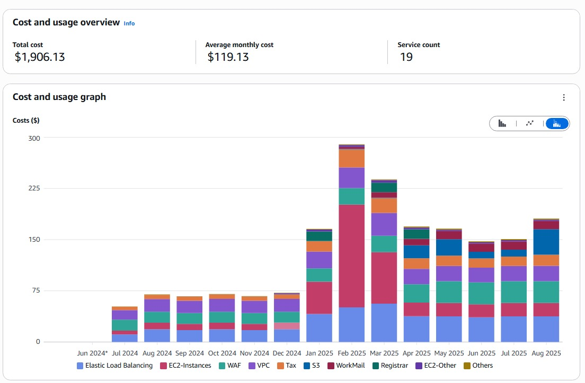
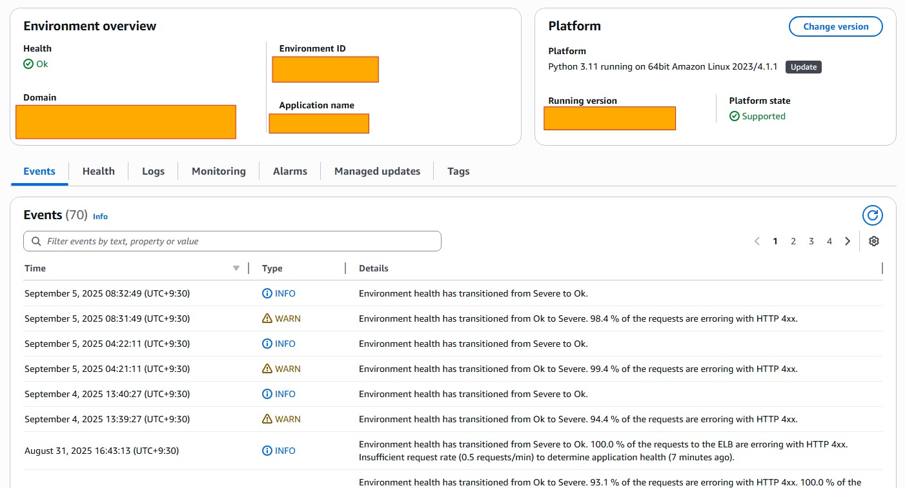
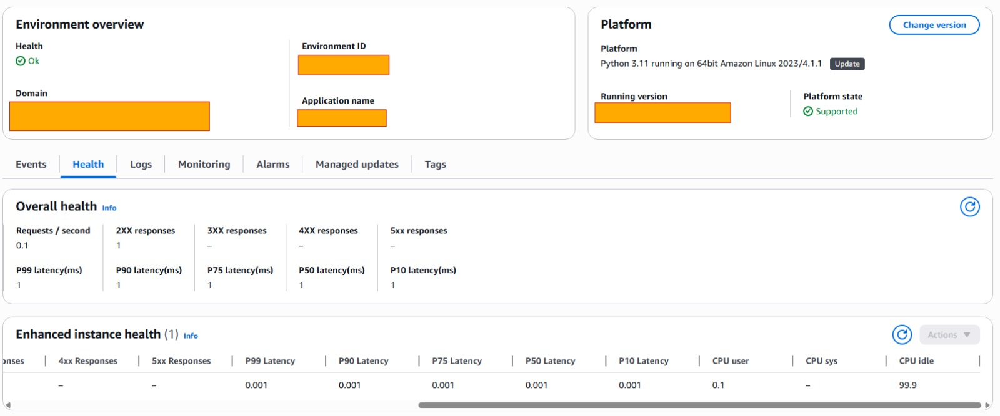
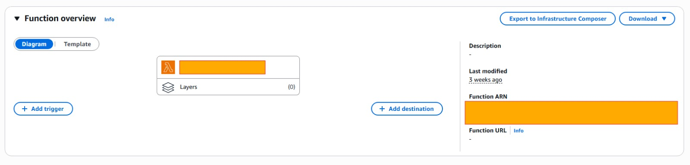
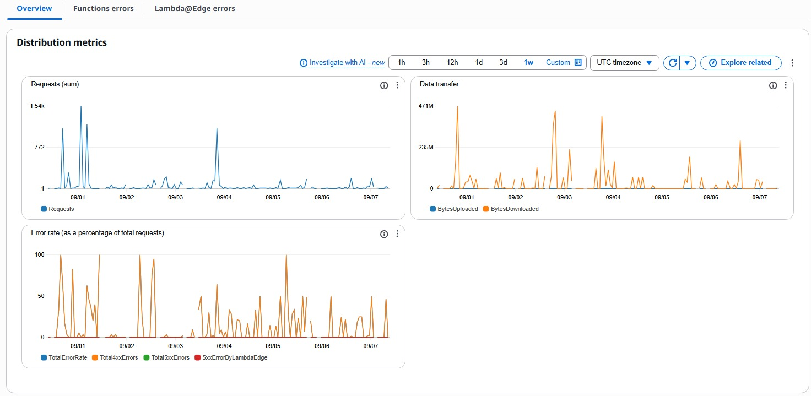
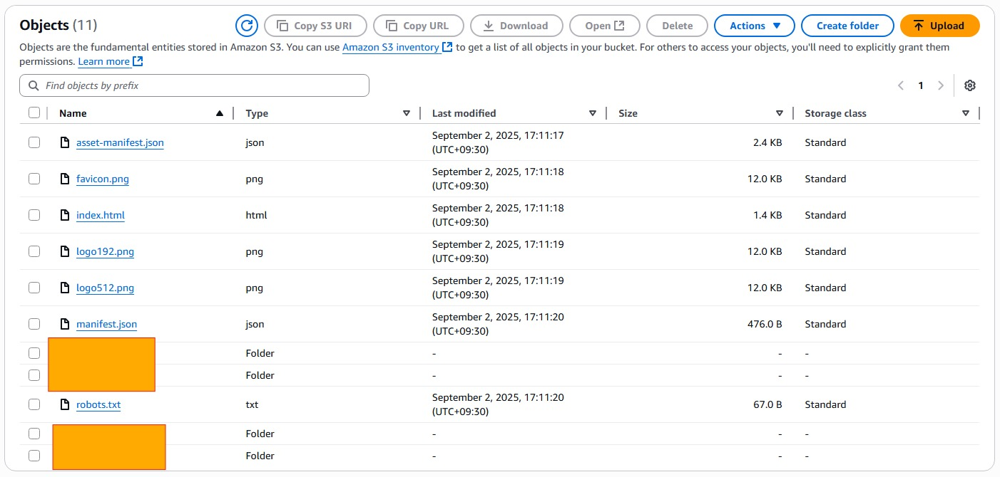
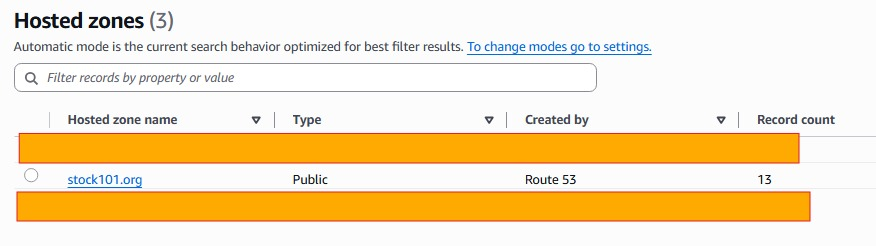
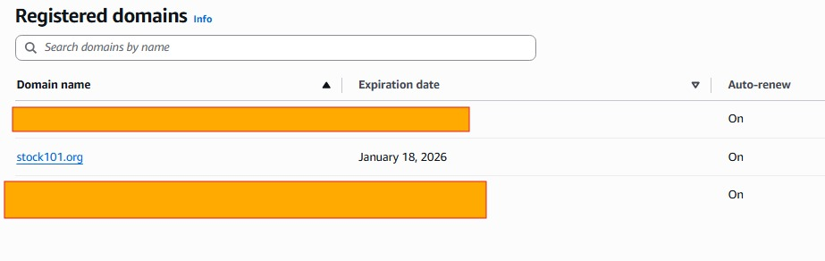
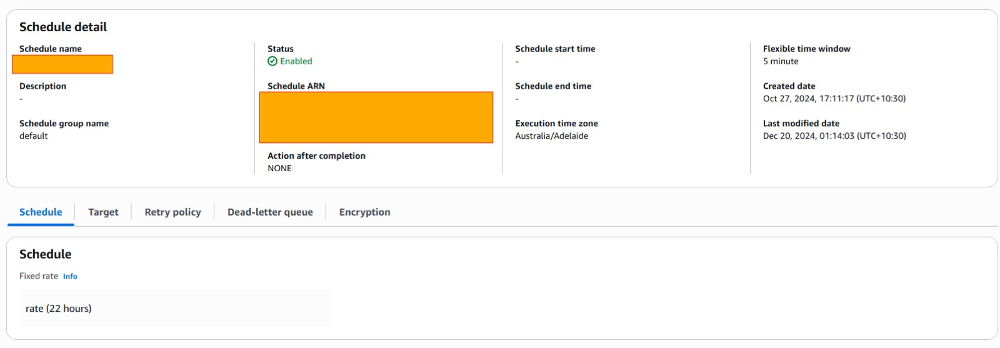

# Stock101 AWS DevOps Project

This repository documents my freelance Cloud & DevOps project for [Stock101.org](https://www.stock101.org), where I architected, deployed, and managed AWS infrastructure with a focus on scalability, performance, and cost optimization.

---

## 🚀 Project Overview
- **EC2 & VPC**: Provisioned and configured secure VPCs with subnets, NAT gateways, and security groups. Deployed scalable EC2 instances with auto scaling and monitoring.
- **Elastic Beanstalk**: Hosted the main application using Python 3.11 platform on Beanstalk. Managed deployments, health checks, and automated scaling.
- **Lambda**: Built event-driven serverless functions for backend automation. Integrated with S3 triggers and EventBridge Scheduler.
- **S3**: Architected storage buckets for structured/unstructured data, static website hosting, and applied lifecycle policies for cost savings.
- **Route 53 & Domains**: Configured hosted zones and registered domains (stock101.org), enabling DNS failover routing.
- **CloudFront (CDN)**: Integrated to deliver applications globally with HTTPS and low latency.
- **EventBridge Scheduler**: Automated recurring tasks such as cleanup and maintenance using fixed-rate schedules.
- **CloudWatch**: Implemented monitoring dashboards, alarms, and logs for proactive troubleshooting.
- **Cost Optimization**: Applied strategies including Reserved Instances, EC2 right-sizing, and S3 Intelligent-Tiering.

---

## 📂 Repository Contents

- `screenshots/` → AWS console screenshots verifying the deployed services.
- `docs/` → Experience letter, project write-up, troubleshooting notes.

---

## 📸 Screenshots
### AWS Cost Explorer

### Elastic Beanstalk

### AWS Lambda

### Amazon S3

### Route 53

### EventBridge

---

## 📜 Verification
- Includes official **experience letter** from Stock101 (see `docs/experience-letter.pdf`).
- Screenshots of AWS services configured for this project are provided under `screenshots/`.

---

## 🔗 Links
- [Stock101 Website](https://www.stock101.org)

